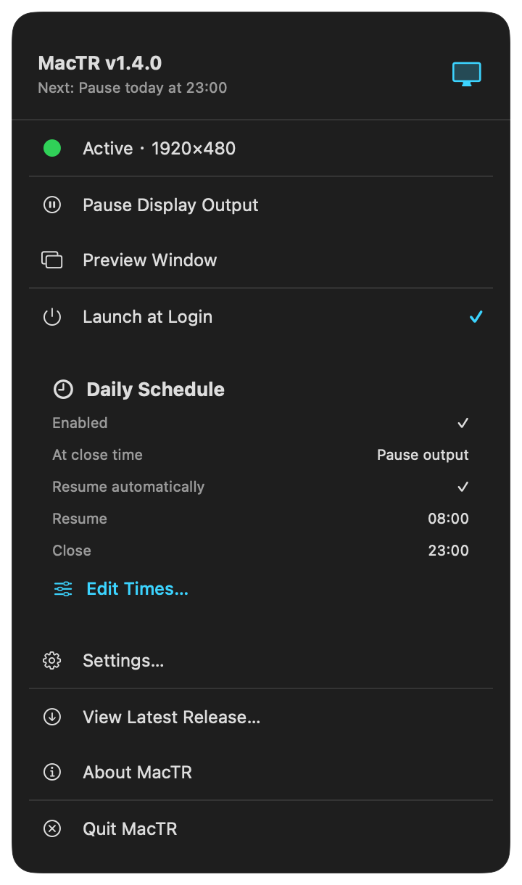
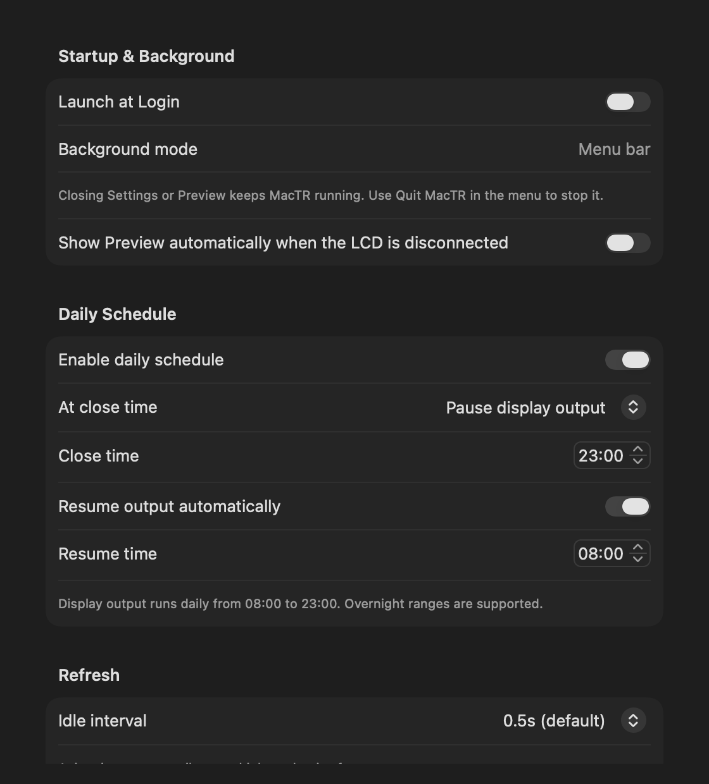

# MacTR — AI Agent & System Monitor for Thermalright LCD

[中文](README.md) · [English](README.en.md)

<p align="center">
  
</p>

Turn the 1920×480 LCD on your Thermalright CPU cooler into a live dashboard that shows
your Mac's vitals **and what your AI coding agents are doing right now** — all native on
macOS, no Windows required.


<sub>Running on a Thermalright Trofeo Vision 9.16 cooler.</sub>


<sub>Live demo (fake data). CPU, GPU, memory, network and fans are visible on the left;
both agents "working" → columns breathe, Bongo Cat types and Pikachu crackles.</sub>

> Fork of [beret21/MacTR](https://github.com/beret21/MacTR), reworked around a central
> **AI Agents** panel that tracks [Claude Code](https://claude.com/claude-code) and
> [Codex](https://openai.com/codex) sessions in real time.

## Highlights

### 🤖 AI Agents panel
Reads your **local** Claude Code and Codex session logs (read-only, no network) and shows,
for each agent, side by side:

- **Current project** and the **last thing it said** — Markdown tables in the message are
  rendered as real aligned tables, not raw `| … |` text.
- **Plan / step progress** — `步骤 4/6` badge + a segmented progress bar, parsed from
  Codex `update_plan` and Claude `TodoWrite`. Stale plans from a finished turn disappear.
- **Today's token usage** — total + In/Out, in a compact `万 / 亿` format.
- **Codex remaining quota** — % left + reset countdown, tracked across all recent sessions.
- **Live status** — the column **breathes** while an agent is working and **flashes** for
  ~10 s when it finishes a turn or needs your input.

### 🖥️ System panels
- **CPU** — usage arc gauge, compact per-core P/E bars, temperature (via
  IOHIDEventSystemClient, no sudo), and 1-minute load.
- **GPU** — device, renderer and tiler utilization, temperature and allocated memory.
- **Memory** — pressure-colored usage gauge plus Active/Wired/Compressed/Available details.
- **Network** — live download/upload rates across non-loopback interfaces with a 30-second trend.
- **Fans** — live RPM and percentage of maximum speed for built-in Mac fans, with distinct
  fanless and unavailable states.
- The bottom system card also keeps the date, clock, uptime and process count.

### 🐱⚡ Desk pets that react to activity
- A **Bongo Cat** taps its keyboard while your agents work (and dozes when idle).
- A **Pikachu** whose electricity crackles harder as CPU load rises, and who hops and
  turns while an agent is running.

### ⚙️ Under the hood
- **Adaptive frame rate** — the LCD runs at ~15 fps only while something is animating
  (agent working, heavy CPU); otherwise it idles at 2 fps to save power.
- **USB hotplug** — auto-reconnect on plug/unplug and sleep/wake.
- **On-Mac preview** — open it from the menu at any time, or opt into showing it
  automatically while the LCD is disconnected.
- **Menu bar app** — runs in the background with no Dock icon; closing Preview or
  Settings does not quit it.

### 🕘 Menu bar, login launch, and daily scheduling

- Pause/resume LCD output, reconnect, preview, and open Settings from the menu bar.
- Uses macOS `SMAppService` for Launch at Login—no hand-written LaunchAgent.
- A daily schedule can pause output at one time and resume at another, including
  overnight active windows.
- The close action can instead quit MacTR. A terminated app cannot start itself at the
  resume time; reopen it manually or use Launch at Login.
- Brightness, rotation, refresh interval, preview behavior, and schedule settings persist.

<table>
  <tr>
    <td width="36%"></td>
    <td width="64%"></td>
  </tr>
</table>

## Download & install

Download either artifact from
[GitHub Releases](https://github.com/luckykong/mac-thermalright-ai-monitor/releases/tag/v1.4.0):

- `MacTR-v1.4.0-macos-arm64.dmg` — recommended; open it and drag MacTR to Applications.
- `MacTR-v1.4.0-macos-arm64.zip` — unzip and move `MacTR.app` to Applications.

libusb is bundled. End users **do not need Homebrew, Swift, Xcode, or any other runtime**.

> This community build is ad-hoc signed and cannot be Apple-notarized without a
> Developer ID. On first launch, Control-click or right-click `MacTR.app`, choose
> **Open**, then confirm once. Normal double-click launch works afterward. Do not
> disable Gatekeeper globally.

## Hardware

| | |
|---|---|
| **Product** | [Thermalright Trofeo Vision 9.16 LCD](https://www.thermalright.com/product/trofeo-vision-9-16-lcd-black/) |
| **Display** | 9.16" IPS, 1920 × 480 |
| **Connection** | USB Type-C (USB 2.0) |
| **Device** | `0416:5408` (LY Bulk protocol) |

## Runtime requirements

- Apple Silicon Mac (M1–M5)
- macOS 15 (Sequoia) or newer
- Thermalright Trofeo Vision 9.16 LCD (the manual Preview still works without hardware)

## Build from source

Only source developers need a Swift toolchain, pkg-config, and libusb:

```bash
brew install libusb pkg-config

git clone https://github.com/luckykong/mac-thermalright-ai-monitor.git
cd mac-thermalright-ai-monitor
swift build -c release

.build/release/MacTR          # menu-bar app; drives the LCD or stays quietly in the menu bar
```

> If your Command Line Tools are broken and `swift build` fails on the package manifest,
> install the Homebrew Swift toolchain (`brew install swift`) and use
> `/opt/homebrew/opt/swift/bin/swift build -c release`.

```bash
./packaging/build-release.sh
```

The release script verifies and builds pinned libusb 1.0.30 from source, then creates
a self-contained app, ad-hoc signature, DMG, ZIP, and `SHA256SUMS.txt` under
`dist/v1.4.0/`.

## Modes

```bash
.build/release/MacTR                 # menu-bar app (LCD, or quiet background mode without it)
.build/release/MacTR --preview       # force the on-Mac preview window
.build/release/MacTR --demo          # drive the LCD with polished fake data (for photos)
.build/release/MacTR --snapshot x.png --cores 10   # render one demo frame to a PNG
.build/release/MacTR --gif x.gif --frames 48 --fps 12 --scale 2   # animated demo GIF
.build/release/MacTR --benchmark 120 # measure achievable LCD frame rate
```

Only one process can hold the USB device at a time — stop the running instance before
using `--demo` / `--benchmark`.

## How agent data is read

MacTR never talks to any network or API. It only reads local session transcripts that the
CLIs already write to disk:

| Agent | Source | What's parsed |
|---|---|---|
| Claude Code | `~/.claude/projects/*/*.jsonl` | assistant messages, `usage` tokens, `TodoWrite` |
| Codex | `~/.codex/sessions/YYYY/MM/DD/*.jsonl` | agent messages, `token_count`, `rate_limits`, `update_plan` |

Token totals are scoped to the local day; the panel gracefully shows the last session's
context when an agent hasn't run yet today.

## Privacy

Metrics and agent transcripts stay local and read-only. There is no telemetry and nothing
is uploaded. “View Latest Release” only opens this repository’s Releases page in your
default browser when you choose it.

## Credits

- [beret21/MacTR](https://github.com/beret21/MacTR) — the original macOS driver this is built on
- [thermalright-trcc-linux](https://github.com/Lexonight1/thermalright-trcc-linux) — LY Bulk protocol reverse engineering
- [fermion-star/apple_sensors](https://github.com/fermion-star/apple_sensors) — IOHIDEventSystemClient temperature reading
- [kuroni/bongocat-osu](https://github.com/kuroni/bongocat-osu) — Bongo Cat sprite
- Pikachu artwork via [PokeAPI/sprites](https://github.com/PokeAPI/sprites) — Pokémon is © Nintendo / Creatures / GAME FREAK; included here as a cosmetic homage only

> The Bongo Cat and Pikachu are purely decorative. If you redistribute builds, note that
> their artwork belongs to the respective owners — swap or remove the embedded
> `BongoCatAsset.swift` / `PikachuAsset.swift` if that matters for your use.

## License

MacTR is available under the [MIT License](LICENSE). Release builds dynamically link
libusb 1.0.30 (LGPL-2.1-or-later); its complete license and source information are bundled
inside the app. Third-party artwork remains under its own terms.

---

Built with Swift + libusb. Developed with [Claude Code](https://claude.com/claude-code).
