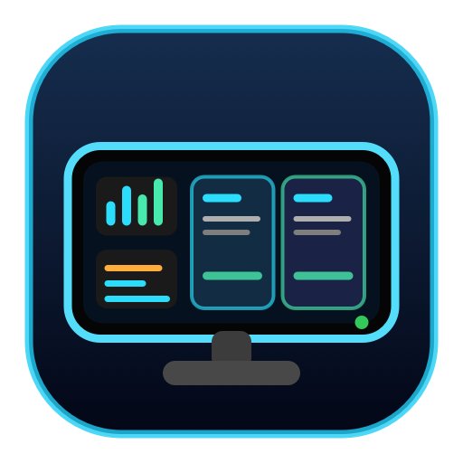
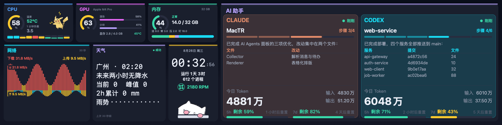
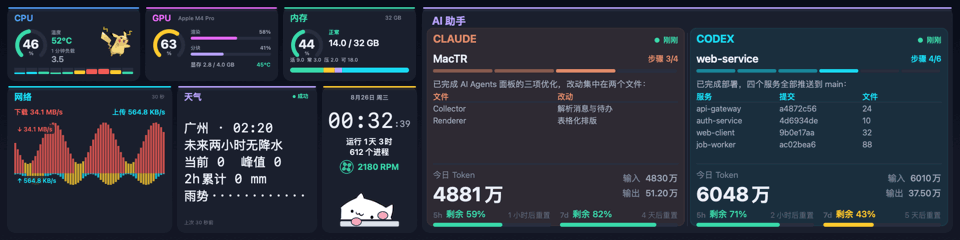
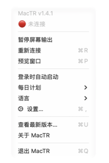
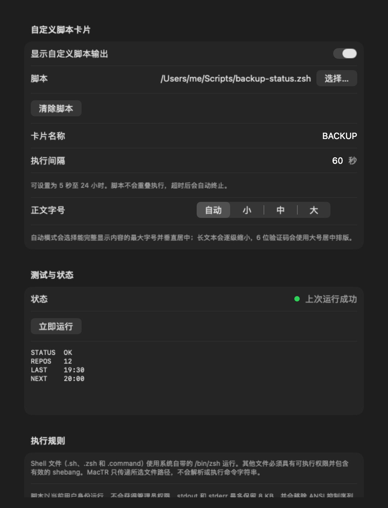

# MacTR —— 利民 LCD 上的 AI Agent & 系统监控

[中文](README.md) · [English](README.en.md)

<p align="center">
  
</p>

把利民 CPU 散热器上的 1920×480 LCD 变成一块实时仪表盘,既显示 Mac 的系统状态,**又能看到你的 AI 编程助手此刻在干什么** —— 全部原生运行于 macOS,无需 Windows。





<sub>上图均由当前渲染器使用内置的确定性演示数据生成，不包含本机指标、
会话内容或脚本输出；实际 LCD 与预览窗口使用同一套 1920×480 渲染路径。</sub>

> 基于 [beret21/MacTR](https://github.com/beret21/MacTR) 改造,核心是一块实时追踪
> [Claude Code](https://claude.com/claude-code) 与 [Codex](https://openai.com/codex)
> 会话的 **AI Agents** 面板。

## 亮点

### 🤖 AI Agents 面板
读取**本地**的 Claude Code 和 Codex 会话日志(只读),左右并排显示每个 agent 的:

- **当前项目**和**它最后说的话** —— 消息里的 Markdown 表格会被渲染成对齐的表格,而不是原始的 `| … |` 文本。
- **计划 / 步骤进度** —— `步骤 4/6` 徽章 + 分段进度条,从 Codex 的 `update_plan` 和 Claude 的 `TodoWrite` 解析而来。上一轮已完成的旧计划会自动消失。
- **今日 Token 用量** —— 总量 + In/Out,用简洁的 `万 / 亿` 格式。是否把命中提示词缓存、被重复读取的上下文算进去,可在设置里自行选择(见下)。
- **剩余额度** —— 剩余百分比 + 重置倒计时。Codex 直接从会话日志里的 `rate_limits` 读取;Claude 需要额外配置一个缓存文件(见下),配好后会并排显示 5 小时与 7 天两个窗口。
- **实时状态** —— agent 工作时该栏**缓慢呼吸**,完成一轮或需要你输入时**闪烁**约 10 秒提醒。

### 🖥️ 系统面板

左侧采用非等分布局：上排是 CPU / GPU / 内存，下排是网速 / 自定义卡片 /
时钟与风扇。日期和时间比旧版更醒目，AI Agents 区域适当收窄，但项目、
消息、步骤、Token 和额度信息仍完整保留。

- **CPU** —— 占用率环形表、紧凑每核 P/E 柱状条、温度(经 IOHIDEventSystemClient,无需 sudo)、1 分钟负载。
- **GPU** —— 设备、Renderer 与 Tiler 利用率、温度和显存占用。
- **内存** —— 按内存压力着色的占用环，以及 Active/Wired/Compressed/Available 明细。
- **网速** —— 所有非回环接口的实时 DOWN / UP 速度位于同一行，30 秒镜像趋势图也分别标出两种速度。当前值和每根趋势柱会按速率分级：不高于 5 MB/s 保持方向色、超过 5 MB/s 变橙、超过 10 MB/s 变红。
- **风扇** —— Mac 内置风扇的 RPM 融合进时钟与 Bongo Cat 卡片；小型转子与 RPM 在同一行显示，并随转速改变动画速度，不再贴近猫咪。单风扇 Mac 只显示一个读数，多风扇用 `×N` 汇总；`FANLESS` 与 `N/A` 含义不同。
- **时钟** —— 大字号显示时间，同时保留日期、秒、运行时间和进程数。

### 🧩 自定义脚本卡片

- 可在设置中选择脚本文件、自定义卡片名称，并设置 5 秒到 24 小时的循环间隔。
- `.sh`、`.zsh` 和 `.command` 通过系统 `/bin/zsh` 运行；其他文件必须有可执行权限和有效 shebang。
- 只显示纯文本 `stdout/stderr`；输出上限 8 KB，ANSI 控制序列会移除。
- 同一个脚本不会重叠执行，并会按间隔自动设置超时；失败时保留上一次成功输出并显示状态。
- 正文字号可选“自动 / 小 / 中 / 大”。自动模式会选择能完整显示内容的最大字号并垂直
  居中；短天气摘要会明显放大，6 位验证码使用大号居中排版，长文本则逐级缩小并在
  超出容量时安全截断。

### 🐱⚡ 会互动的桌宠
- **Bongo Cat**:agent 工作时在键盘上啪嗒啪嗒敲字,空闲时打盹。
- **皮卡丘**:CPU 负载越高电弧越猛;agent 运行时它还会蹦跳、左右转身。

### ⚙️ 底层
- **三档性能模式** —— `Balanced` 默认为常驻运行设计；`Eco` 进一步降低刷新，
  `Smooth` 换取更流畅动画。各档会同时调整帧率和指标采集节奏。
- **低资源渲染** —— 复用 1920×480 栅格和预览帧，亮度处理使用优化的 C 查找表，
  状态更新与本地 Agent 日志扫描均有限流，不再为每帧堆积任务或图像缓存。
- **USB 热插拔** —— 插拔、睡眠/唤醒后自动重连。
- **本机预览** —— 可随时从菜单栏打开；也可选择在 LCD 断开时自动显示。
- **菜单栏应用** —— 后台运行、无 Dock 图标，关闭预览和设置窗口不会退出。
- **双语界面** —— 首次运行默认使用简体中文；可从菜单栏或“设置 → 通用”
  随时切换为 English，菜单、设置窗口、状态提示和 LCD 仪表盘会立即同步更新。
  语言选择会持久保存。

性能模式的主要取舍是动画流畅度和指标时效性；USB 输出分辨率始终保持
1920×480，不会因节能而降低画质。

| 模式 | Agent 活跃动画 | 空闲刷新 | 适用场景 |
|---|---:|---:|---|
| Eco | 最高 2 fps | 最慢约 2 秒/帧 | 最低常驻占用 |
| Balanced（默认） | 最高 4 fps | 最慢约 1 秒/帧 | 长时间常驻 |
| Smooth | 最高 10 fps | 最慢约 0.5 秒/帧 | 更流畅的桌宠和风扇动画 |

在本次连接设备的实测中，Balanced 在 Agent 活跃时稳定约为 47–54 MB 物理内存、
10 个线程和约 8% CPU；不同 Mac、日志规模和采集状态会有差异。

### 🕘 菜单栏、开机自启与定时

- 在菜单栏直接暂停/恢复 LCD、重连设备、打开预览和设置。
- 菜单栏的“语言”子菜单和设置页顶部均可选择“简体中文 / English”；
  切换无需重启 App。
- 使用 macOS 原生 `SMAppService` 设置登录时自动启动，无需手写 LaunchAgent。
- 每日计划可在指定时间暂停 LCD，并在另一时间自动恢复；支持跨午夜时段。
- 关闭动作也可以选择“退出整个 App”。退出后进程无法自行定时恢复，只能手动启动或等待下次登录自启。
- 亮度、旋转、刷新率、预览行为和定时设置都会持久保存。

<table>
  <tr>
    <td width="36%"></td>
    <td width="64%"></td>
  </tr>
</table>

<sub>菜单图来自正在运行的原生 `NSMenu`；设置图来自同一版 App 的真实 SwiftUI 界面。</sub>

## 发布方式

本仓库**不再公开提供预编译 App、DMG 或 ZIP**。GitHub Releases 只保留版本记录
以及 GitHub 自动生成的源码压缩包；这些 `Source code` 文件不是可执行程序。

原因是当前界面包含 Bongo Cat 与皮卡丘等第三方装饰素材，其美术版权不属于
本项目。源码仍可用于学习和个人构建，但请不要直接重新分发包含这些素材的
构建产物。需要公开分发时，应先替换或移除相关素材并自行核查授权。

## 硬件

| | |
|---|---|
| **产品** | [利民 Trofeo Vision 9.16 LCD](https://www.thermalright.com/product/trofeo-vision-9-16-lcd-black/) |
| **屏幕** | 9.16" IPS,1920 × 480 |
| **接口** | USB Type-C(USB 2.0) |
| **设备** | `0416:5408`(LY Bulk 协议) |

## 运行要求

- Apple Silicon Mac(M1–M5)
- macOS 15(Sequoia)或更新
- 利民 Trofeo Vision 9.16 LCD（不连接硬件时仍可手动打开本机预览）

## 从源码打包独立 App

以下步骤会在本机生成可复制到其他 Apple Silicon Mac 的独立 App、DMG 和 ZIP。
最终 App 会内置 libusb；目标 Mac 不需要 Homebrew、Swift 或 Xcode。

### 1. 准备构建环境

- Apple Silicon Mac，macOS 15 或更新版本。
- 支持 Swift 6.1 的 Xcode / Command Line Tools（建议 Xcode 16.3 或更新版本）；
  只使用 Command Line Tools 时也要确保 `swift`、
  `xcrun`、`clang`、`make`、`codesign`、`hdiutil` 和 `iconutil` 可用。
- [Homebrew](https://brew.sh/) 提供的 `pkg-config`。打包脚本会自行下载并从
  源码构建固定的 libusb 1.0.30，不使用 Homebrew 的 libusb 作为运行依赖。

```bash
xcode-select --install                 # 已安装时系统会提示
brew install pkg-config

swift --version
xcrun --sdk macosx --show-sdk-path
pkg-config --version
```

### 2. 获取源码

```bash
git clone https://github.com/luckykong/mac-thermalright-ai-monitor.git
cd mac-thermalright-ai-monitor
git checkout main
```

### 3. 生成独立安装包

```bash
chmod +x packaging/build-release.sh
./packaging/build-release.sh
```

脚本会依次完成：

1. 下载 libusb 1.0.30 源码并核对固定 SHA-256。
2. 以 macOS 15、arm64 为目标编译 libusb 和 MacTR。
3. 创建完整的 `MacTR.app`，把 libusb 和许可文件放入 App。
4. 清除 Homebrew、SwiftPM 缓存及开发机绝对路径依赖。
5. 对 App 做 ad-hoc 签名，生成 DMG、ZIP 和校验文件。

主要输出：

```text
.build/release-package/MacTR.app
dist/v1.4.4/MacTR-v1.4.4-macos-arm64.dmg
dist/v1.4.4/MacTR-v1.4.4-macos-arm64.zip
dist/v1.4.4/SHA256SUMS.txt
```

### 4. 验证产物

```bash
codesign --verify --deep --strict --verbose=2 \
  .build/release-package/MacTR.app

otool -L .build/release-package/MacTR.app/Contents/MacOS/MacTR

cd dist/v1.4.4
shasum -a 256 -c SHA256SUMS.txt
hdiutil verify MacTR-v1.4.4-macos-arm64.dmg
```

`otool -L` 的结果中不应出现 `/opt/homebrew`、`.build` 或开发机绝对路径。

### 5. 在另一台 Mac 上首次运行

打开 DMG 并把 `MacTR.app` 拖入“应用程序”，或解压 ZIP 后移动 App。当前构建
只有 ad-hoc 签名，没有 Apple Developer ID 公证；首次启动请按住 Control
点击或右键点击 App，选择“打开”并确认一次。不要全局关闭 Gatekeeper。

### 快速调试构建

只在当前开发机调试、无需生成独立 App 时，可以使用 Homebrew 的 libusb：

```bash
brew install libusb pkg-config
swift build -c release
.build/release/MacTR --preview
```

这个快速构建可能依赖 `/opt/homebrew`，不能直接复制给其他 Mac；跨设备使用请
运行上面的 `packaging/build-release.sh`。

### 运行测试

```bash
./scripts/test.sh
```

测试使用 swift-testing。它随命令行工具一起安装，但 SwiftPM 不会自动把它的
framework 与动态库目录加入搜索路径，直接执行 `swift test` 会报
`no such module 'Testing'`。上面的脚本负责补齐这些路径；如果装了完整版
Xcode，脚本会跳过这些参数直接调用 `swift test`。

## 运行模式

```bash
.build/release/MacTR                 # 菜单栏应用(有 LCD 走 LCD,没有则安静驻留后台)
.build/release/MacTR --preview       # 强制打开本机预览窗口
.build/release/MacTR --demo          # 用内置演示数据驱动 LCD
.build/release/MacTR --snapshot x.png --cores 10        # 渲染一帧演示数据到 PNG
.build/release/MacTR --snapshot x.png --cores 10 --language en  # 渲染英文仪表盘
.build/release/MacTR --snapshot x.png --redact-agents   # 真实系统指标 + 脱敏会话文本
.build/release/MacTR --gif x.gif --frames 48 --fps 12 --scale 2   # 生成演示 GIF
.build/release/MacTR --benchmark 120 # 测量 LCD 可达帧率
.build/release/MacTR --smc-test      # 诊断内置风扇读取
```

同一时刻只能有一个进程占用 USB 设备 —— 用 `--demo` / `--benchmark` 前先停掉正在运行的实例。

## Agent 数据怎么读取

除了下面单独说明的 Claude 额度查询外,MacTR 不访问网络,只读取这些 CLI 本来就写到
本地磁盘的会话记录:

| Agent | 来源 | 解析内容 |
|---|---|---|
| Claude Code | `~/.claude/projects/*/*.jsonl` | 助手消息、`usage` token、`TodoWrite` |
| Codex | `~/.codex/sessions/YYYY/MM/DD/*.jsonl` | agent 消息、`token_count`、`rate_limits`、`update_plan` |

Token 总量按本地自然日统计;某个 agent 今天还没跑过时,面板会优雅地显示它上一次会话的上下文。

### 缓存 Token 算不算?

长会话里绝大部分输入都是**命中提示词缓存被重复读取的上下文** —— 实测中它能占到输入侧
九成以上,所以把它算进去的总量,通常会比 Claude Code / Codex 自己显示的数字大一个量级。
两种口径都是对的,只是回答的问题不同,所以做成了设置项:**设置 → 显示 → Agent Token 用量
→「计入缓存读取的 Token」**(默认开启,保持旧版行为)。

| | 开启(默认) | 关闭 |
|---|---|---|
| 回答的问题 | 今天一共往模型里送了多少 token | 今天真正新产生了多少内容 |
| Claude | `input_tokens + cache_creation + cache_read` | `input_tokens + cache_creation` |
| Codex | `input_tokens + cache_write` | `input_tokens - cached_input + cache_write` |

缓存**写入**两种口径下都计入 —— 它是第一次发送的新内容,只是顺带被存了下来。
切换开关立即生效,不需要重新扫描日志。

关闭后,屏幕上的「今日 Token」旁边会出现一个 **`不含缓存`** 徽章(英文界面为 `NO CACHE`),
用列本身的主题色绘制。默认口径不加任何标记 —— 没有徽章的卡片,含义和这个设置出现之前完全一样。

### Claude 剩余额度:唯一的一次联网

Codex 把 `rate_limits.primary`(已用百分比 + 重置时间)写进**每一条** rollout 日志,
所以 MacTR 顺手就能读到。Claude Code 不把限额信息写到磁盘任何地方 ——
`~/.claude/projects`、`stats-cache.json`、`sessions/` 里都没有。唯一的来源就是
带 OAuth token 请求 `https://api.anthropic.com/api/oauth/usage`。

MacTR 因此会做**这一个**网络请求,并排显示 5 小时与 7 天两个窗口。具体行为:

- token 从 Keychain 里 Claude Code 自己那一项(`Claude Code-credentials`)读取,
  走 `/usr/bin/security`。首次会弹出钥匙串授权,点“始终允许”即可。
- **绝不刷新 token。** 那一项里的 refresh token 是和 Claude Code 共用的,轮换它
  会把 Claude Code 登出。access token 过期时额度条直接消失,等你下次正常使用
  Claude Code 时它自己会续期。
- 最快 5 分钟请求一次;失败后退避到 15 分钟。请求在后台线程,不阻塞指标采集。
- 请求只发出 token,不携带任何会话内容、项目名或本机信息。

不想要这个请求的话,把钥匙串授权拒绝掉即可 —— 额度条不显示,其余功能不受影响。

## 隐私

指标与 Agent 会话读取全部在本地、只读。无遥测,不上传任何使用数据。

唯一的出站请求是上面说明的 Claude 额度查询:只发送你本机 Claude Code 已有的
OAuth token,用于换取你自己的用量百分比。“查看最新版本”则只会按你的操作在默认
浏览器中打开本仓库 Releases 页面。

## 致谢

- [beret21/MacTR](https://github.com/beret21/MacTR) —— 本项目所基于的原版 macOS 驱动
- [thermalright-trcc-linux](https://github.com/Lexonight1/thermalright-trcc-linux) —— LY Bulk 协议逆向
- [fermion-star/apple_sensors](https://github.com/fermion-star/apple_sensors) —— IOHIDEventSystemClient 温度读取
- [kuroni/bongocat-osu](https://github.com/kuroni/bongocat-osu) —— Bongo Cat 精灵图
- 皮卡丘立绘来自 [PokeAPI/sprites](https://github.com/PokeAPI/sprites) —— 宝可梦版权归 © 任天堂 / Creatures / GAME FREAK 所有,此处仅作装饰性致敬

> Bongo Cat 与皮卡丘纯属装饰。若你要分发构建产物,请注意它们的美术版权归各自所有者;
> 需要的话可替换或删除内嵌的 `BongoCatAsset.swift` / `PikachuAsset.swift`。

## 许可证

MacTR 使用 [MIT License](LICENSE)。本地打包产物动态链接 libusb 1.0.30
（LGPL-2.1-or-later），完整许可和来源信息已包含在 App 内。
第三方素材各自遵循其自身条款。

---

用 Swift + libusb 构建。与 [Claude Code](https://claude.com/claude-code) 协作开发。
